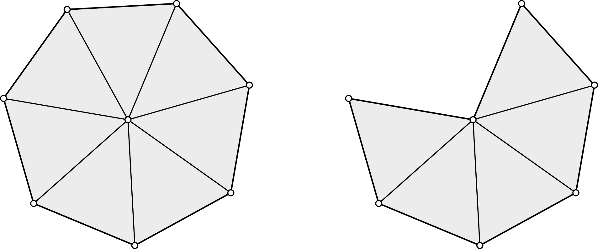
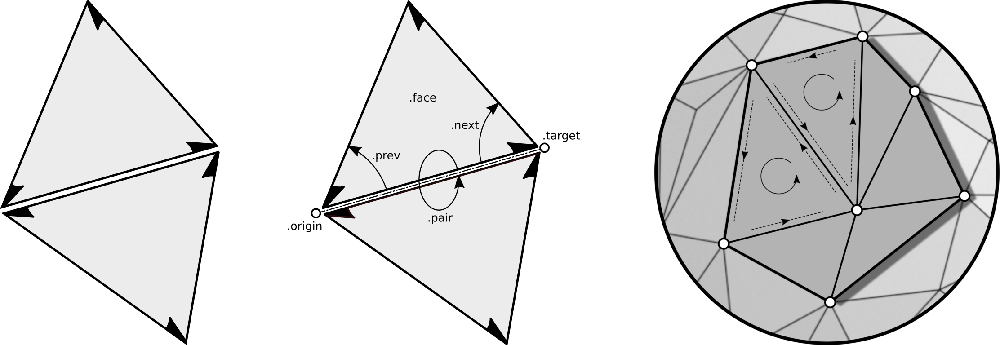

.. _mesh-rep-label:

Mesh basics
===========

.. image:: figures/dragon_full.png

We define a **polygonal mesh** by specifying two sequences:

   * a sequence :math:`V = (v_i)_{i=0}^{n-1}` of vertices such that
     :math:`v_i \in \mathbb{R}^3` and
   * a sequence :math:`F = (f_j)_{j=0}^{m-1}` of faces.

Faces :math:`f \in F` are sequences themselves: a :math:`k`-tuple
:math:`f = (i_0, \dots, i_{k-1})` of integers defines a face of valence
:math:`k` with vertices :math:`v_{i_0}, \dots, v_{i_{k-1}}`. In general,
faces are neither planar nor convex. If :math:`k` is equal to three for
all faces, the pair :math:`(V, F)` defines a **triangle mesh**.

.. note::

   We can identify the ordered sequence of vertices with a matrix
   :math:`V \in \mathbb{R}^{n \times 3}`. Replacing :math:`V` with
   :math:`W \in  \mathbb{R}^{n \times 3}` yields a mesh with identical
   **combinatorics** :math:`F` but different vertex positions.

.. _manifold-mesh-label:

Manifold meshes
---------------

A pair :math:`(V,F)` as just defined can describe arbitrary collections of
polygonal faces. For simplicity we only consider triangular faces in the
following definitions. A triangle mesh is **2-manifold** if the faces incident
to a vertex either form a closed or an open triangle fan.

The **orientation** of a face is defined by the cyclic ordering of its
incident vertices as specified in the definition of :math:`f`. The orientation
of two adjacent faces is **compatible**, if the two vertices of the common edge
appear in opposite order. A manifold mesh is **orientable** if any two adjacent
faces have compatible orientation.

.. note::

   Both, manifoldness and orientability are determind by the mesh
   combinatorics :math:`F` and do **not** depend on a concrete geometric
   realization (an embedding defined by specifying :math:`V`).

.. _halfedge-label:

Halfedge representation
-----------------------

Any orientable 2-manifold mesh can be represented using halfedges. Conceptually
one splits each edge of a mesh into two so called halfedges. Each halfedge is
oriented according to the orientation of its incident face. In this way
adjacent faces give rise to oppositely oriented halfedges:

The :class:`~m3sh.hds.Mesh` class provides a generic halfedge data structure
for orientable 2-manifold meshes. The combinatorics of a mesh is defined via
its halfedges and their attributes. Each halfedge is aware of its incident
:attr:`~m3sh.hds.Halfedge.face`, its :attr:`~m3sh.hds.Halfedge.origin` and
:attr:`~m3sh.hds.Halfedge.target` vertex, the neighboring halfedge
:attr:`~m3sh.hds.Halfedge.pair`, as well as its successor
:attr:`~m3sh.hds.Halfedge.next` and predecessor halfedge
:attr:`~m3sh.hds.Halfedge.prev` in a face defining loop of halfedges.

.. note::

   The explicit representation of a face as a list of its vertices can
   be reconstructed from the set of halfedges -- hence, the sequence :math:`F`
   is not stored explicitly. It is sufficient to know one halfedge per face
   to compute the face defining loop of halfedges (or vertices).

References
----------

1. K. Crane: `A Survey of Efficient Structures for Digital Geometry
   Processing <https://www.cs.cmu.edu/~kmcrane/Projects/OutOfCoreSurvey/>`_,
   2006.

2. H. Brönnimann: `Designing and Implementing a General Purpose Halfedge
   Data Structure <https://link.springer.com/chapter/10.1007/3-540-44688-5_5>`_,
   Proceedings of the 5th International Workshop on Algorithm Engineering,
   2001.

