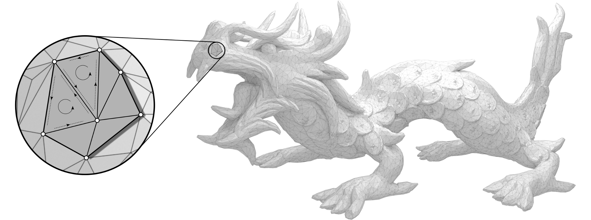

m3sh -- a mutable halfedge mesh data structure 
==============================================

The m3sh package provides a pure Python implementation of a generic halfedge
data structure for orientable 2-manifold meshes -- the discrete analogue of 
orientable surfaces in Euclidean 3-space. 

.. toctree::
   :maxdepth: 1
   :caption: Basic usage and examples

   basics
   usage
   iterators
   
.. toctree::
   :maxdepth: 1
   :caption: Modules - API

   mesh
   helper
   
   
Disclaimer
==========

Links to 3rd party websites are being provided as a convenience and for 
informational purposes only; they do not constitute an endorsement or an 
approval of any of the products, services or opinions of the corporation or 
organization or individual operating the 3rd party website. We bear **no** 
responsibility for the accuracy, legality or content of external sites or
for that of subsequent links.
